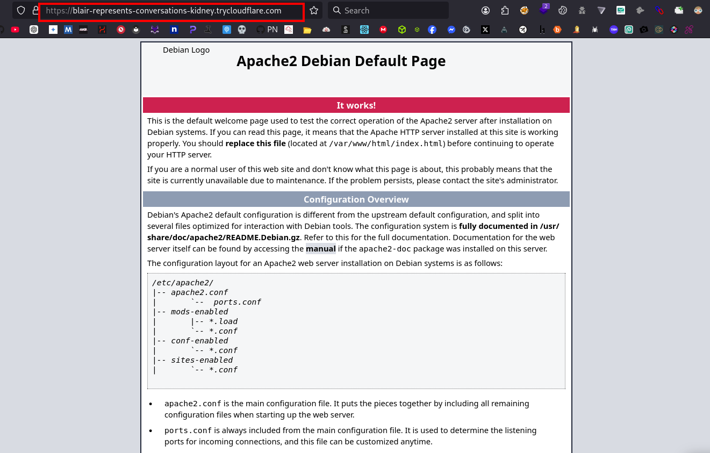

<h2 align="center">
  🪝 Webhook Server Tunnel
</h2>


 
<p align="center">
    <a href="https://visitorbadge.io/status?path=https%3A%2F%2Fgithub.com%2Fl0n3m4n%2FSearchToolkit">
        
    </a>
    <a href="https://www.facebook.com/UEVOLVJU">
        
    </a>
      <a href="https://www.twitter.com/UEVOLVJU">
        
    </a>
    <a href="https://medium.com/@l0n3m4n">
        
    </a>
    <a href="https://www.buymeacoffee.com/l0n3m4n">
        
    </a>  
    <a href="mailto:ehph@proton.me">
      
    </a>
    <a href="https://github.com/l0n3m4n/SearchToolkit/blob/main/assets/contributing.md">
      
  </a>
</p>
<br/>

This Python script serves a local directory over HTTP and exposes it securely to the internet via a reverse tunnel using either:

- Serveo (SSH-based tunneling)
- Cloudflared (Cloudflare Tunnel)

It’s especially useful for:

- 📁 Hosting payloads or exploits during red team exercises or CTFs
- 📤 Exfiltrating data from compromised targets in a controlled environment
- 🧪 Testing XSS, CSRF, and SSRF vulnerabilities by exposing local endpoints
- 🌐 Simulating external servers during bug bounty engagements
- 💻 Demonstrating proof-of-concepts (PoCs) for file uploads or callbacks
- 🔐 Secure remote access to localhost web apps for testing
- 📡 Bypassing NAT/firewall restrictions without port forwarding


---

## 🚀 Features

- HTTP server using Python's built-in modules
- Logs all request headers to `headers.log`
- Expose server via:
  - 🌐 [Serveo](https://serveo.net)
  - ☁️ [Cloudflared](https://developers.cloudflare.com/cloudflare-one/)
- ANSI-colored terminal output
- Easy to use CLI

---

## 🛠 Requirements

- Python 3.6+
- `cloudflared` (only if Serveo is unavailable)

---

## 📦 Installation

```bash
# Clone the repo
git clone https://github.com/l0n3m4n/webhook.git
cd webhook

# Make it executable
chmod +x webhook.py

# (Optional) Install cloudflared if not using Serveo
sudo apt install cloudflared  # Or follow: https://developers.cloudflare.com/cloudflare-one/connections/connect-apps/install-and-setup/
```
## 📡 Usage
```bash
sudo python3 webhook.py -p 8080 -d /var/www/html
```




- This will:
    - Serve files at http://localhost:8080
    - Attempt to expose it via Serveo
    - If Serveo is down, it will fallback to cloudflared tunnel

## 🔐 Security Notes
- This tool uses SSH for Serveo and a reverse proxy for Cloudflared.
- Ensure you trust any services you expose publicly.
